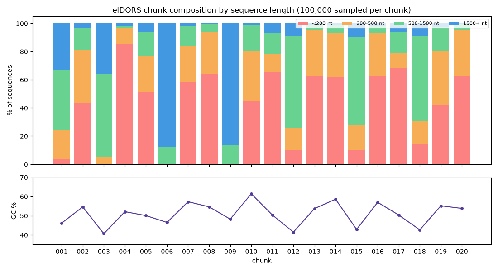
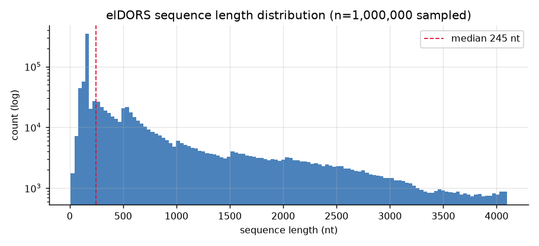
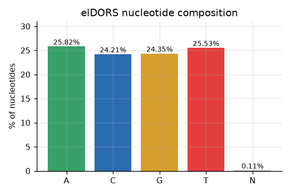
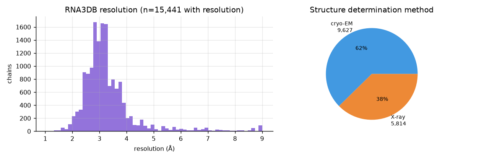
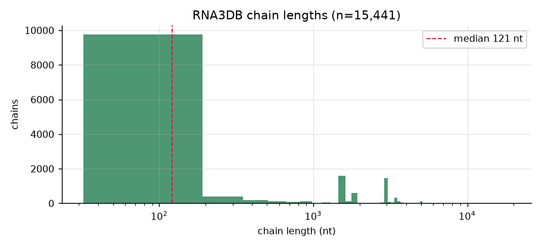
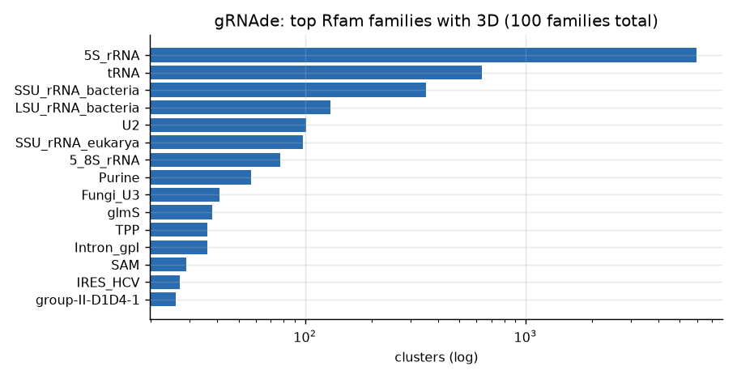
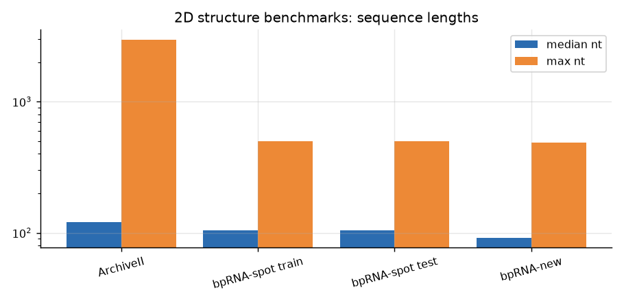

# RNA Data Exploration Report

**Generated**: 2026-09-12 · **Scripts**: `scripts/explore_rna_data.py`,
`scripts/explore_eldors_chunks.py` · **Figures**: `exploration/figures/`

---

## 1. Sequence corpus (elDORS v1 + RNAcentral 27)

### Headline numbers
| Metric | Value |
|---|---|
| Total sequences | 1,369,926,204 (elDORS 1,323,715,880 + RNAcentral 46,210,324) |
| Total nucleotides (elDORS est.) | ~1.25 trillion |
| Alphabet | 5 symbols: A, C, G, T, N (no IUPAC ambiguity codes) |
| Length range | 10–4,096 nt (hard bounds from elDORS clustering) |
| Cross-chunk sample | 1,000,000 seqs: median 245 nt, mean 657 nt |
| Single-chunk sample (001, 2M seqs) | median 730 nt, mean 1026 nt |

### KEY FINDING: the 20 chunks are source-partitioned, not homogeneous

Sampling 100k sequences from every chunk reveals **three distinct data regimes**:

| Regime | Chunks | Median length | Signature |
|---|---|---|---|
| **Read-length** | 4, 8, 13, 14, 16, 17, 20 (+partial 2,5,7,10,11,19) | exactly ~151 nt | 60–85% of sequences <200 nt → short sequencing reads |
| **Assembled / medium** | 1, 3, 12, 15, 18 | 604–1155 nt | broad 200–1500 nt distribution |
| **Long transcripts** | 6, 9 | 2,200–2,400 nt | 86–88% of sequences >1500 nt |

GC content varies from **40.7%** (chunk 3) to **61.4%** (chunk 10), consistent
with organism/metagenome variation. N-content ranges 0.000–0.619%.

### Curation implications
- The **151-nt population is read-length data** (~7–13 chunks): legitimate RNA
  fragments, but unassembled. Options: (a) keep all (max coverage), (b) keep
  with a per-chunk cap so long transcripts are not drowned out, (c) drop for
  a "clean" training tier.
- Recommended minimum-length filter: **≥20 nt** (only 0.029% of sequences fall below).
- N-masking: 0.1% average, negligible; keep.
- Chunks 6 and 9 are the natural source for **long-context** training samples.

---

## 2. 3D structural data

### Coverage
| Metric | Value |
|---|---|
| Chain-level structures (union) | 27,452 |
| Unique sequences with 3D | **6,661** |
| PDB entries covered | 6,846 |
| Rfam families with any 3D representative | **100 of 4,227 (2.4%)** |
| Rfam-mapped sequences (full region) | 10,070,931 |

### Quality (RNA3DB filtered set, n=15,441 chains)
| Metric | Value |
|---|---|
| Median resolution | **3.10 Å** |
| ≤4 Å | 13,750 chains (89%) |
| ≤2.5 Å | 1,991 chains (13%) |
| ≤2.0 Å | 303 chains |
| Method split | cryo-EM 62% · X-ray 38% |
| Median chain length | 121 nt |

### Family concentration
The 3D data is dominated by a few large families:
5S rRNA (5,976 clusters) · tRNA (636) · SSU rRNA bacteria (354) ·
LSU rRNA bacteria (130) · U2 snRNA (101) · SSU rRNA eukarya (98) ·
5.8S rRNA (77) · Purine riboswitch (57).

### Curation implications
- Deduplicate at the sequence level: 15,441 chains → 3,157 unique sequences
  (rRNA redundancy is extreme).
- Practical contact-map training window: length 32–1024 nt with ≤4 Å filter
  → ~2,400–2,900 unique sequences (augmented by crops → millions of pairs).
- The 100-family/5.3M-sequence fold-inheritance layer is the main lever to
  widen supervision beyond the gold set (see `plans/13-sequence-structure-gap-strategy.md`).

---

## 3. Benchmarks

### 2D structure (supervised fine-tuning + eval)
| Dataset | Records | Median len | Max len | Role |
|---|---|---|---|---|
| ArchiveII | 3,975 | 120 | 2,968 | standard test |
| bpRNA-spot train | 10,934 | 104 | 498 | training |
| bpRNA-spot val | 1,330 | 104 | — | validation |
| bpRNA-spot test | 1,411 | 104 | 499 | test |
| bpRNA-new | 5,401 | 92 | 489 | cross-family test |
| bpRNA-1m (full) | 66,715 | — | — | full database |
| RNAStrAlign | 27,125 | — | — | training (TurboFold II) |

### Fitness / splicing
| Dataset | Scale |
|---|---|
| RNAGym | >30 DMS assays, >1M measurements |
| NABench | 162 assays, 2.6M mutated sequences |
| Spliceator | 4 species × 20k sequences (600 nt windows) |
| SpliceBERT | pre-mRNAs from 72 vertebrates |
| G3PO | 147 eukaryote species, >20k genes |

---

## 4. Consolidated recommendations for the ML phase

1. **Pretraining corpus**: use full elDORS; apply ≥20 nt filter; optionally
   weight chunks to balance the read-length vs transcript populations.
2. **Vocabulary**: 5 tokens (A,C,G,T,N) + specials — no 25-token IUPAC
   vocabulary needed (unlike NucleicBERT, elDORS is already normalized).
3. **Context length**: 4096 nt is fully lossless; 1024 (NucleicBERT's choice)
   truncates >50% of long-chunk sequences; **2048 recommended** as
   cost/coverage compromise.
4. **3D fine-tuning**: start from RNA3DB filtered 15,441 chains, dedup to
   3,157 sequences, augment by cropping; evaluate on the documented split.
5. **Held-out evaluation**: CASP15/16 + RNA-Puzzles remain untouched blind sets.
6. **Split**: md5-based 80/10/10 on sequence headers (`catalog/splits/`).

## Files
| File | Content |
|---|---|
| `../figures/01–08_*.png` | 8 exploration figures |
| `reports/exploration_stats.json` | all computed statistics |
| `reports/eldors_chunk_profiles.csv` | per-chunk length/GC/N profile |
